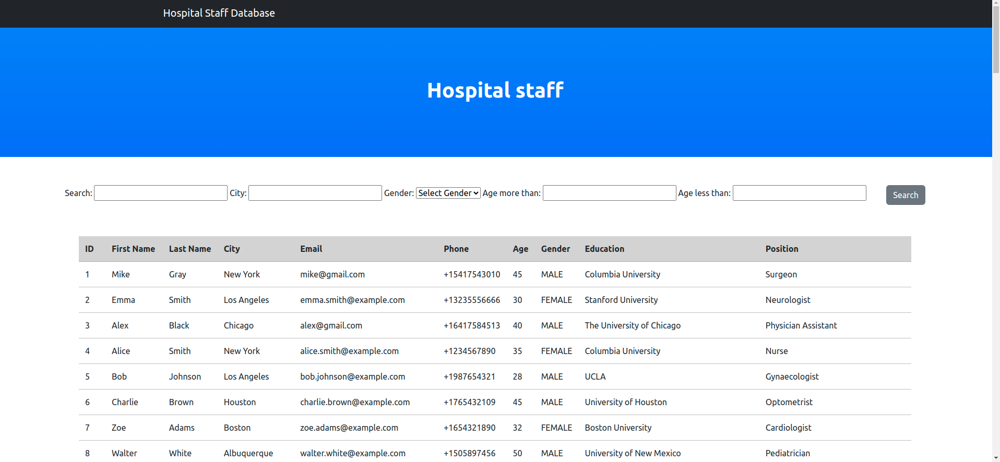
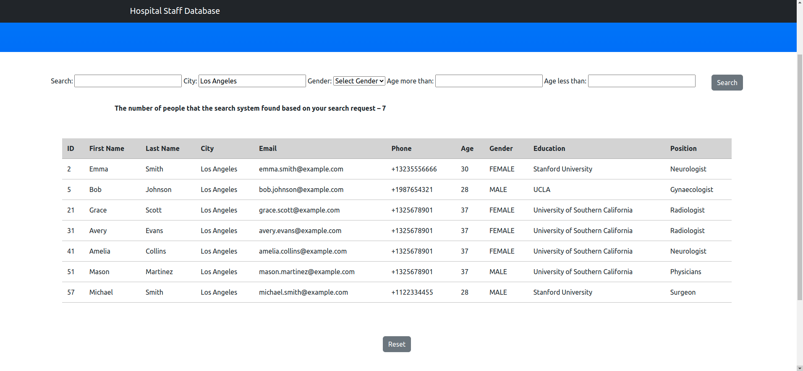
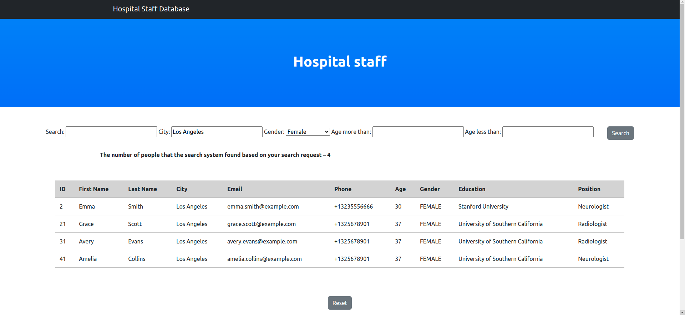
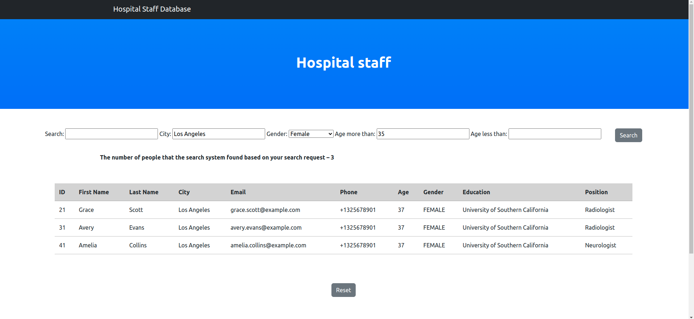
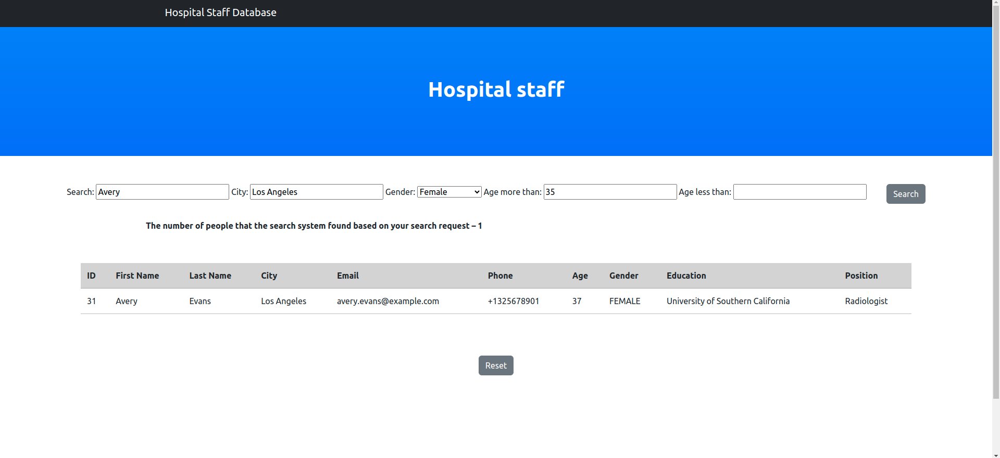

# hospital_staff_database
  
API staff is supposed to be run using port 8080 (only)  
  
1. run api using 8080 port  
2. pun Hospital Staff Database (using standard port 8000)  
    

## Search system was implemented.  
### There are 4 type of search: city, gender, restriction by age, and general search (search by rest of the fields: {"first_name", "last_name", "email", "phone", "university", "profession"})  
  
  Here is my part of the work on [a group project](https://github.com/mkskh/hospital_database_-group_project-) in the group. The project featured 3 different pages, mine was a separate one, which I worked on independently. I decided to put my part of the project in a separate repository to show what I did.  

  ## How it looks like:
    
### Start  
  
    
    
### City  
  
  
  
### Gender  
  
  
  
  ### Age
  
  
  
### Name  
  
    
  